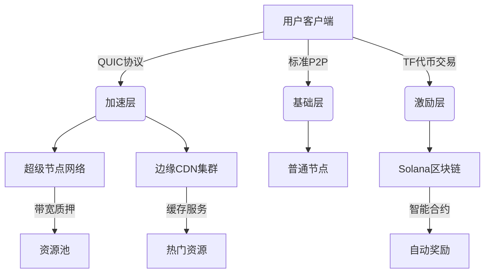
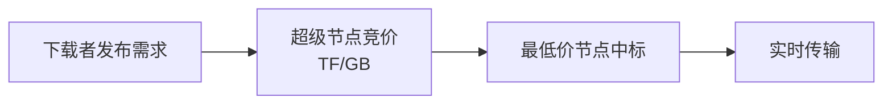
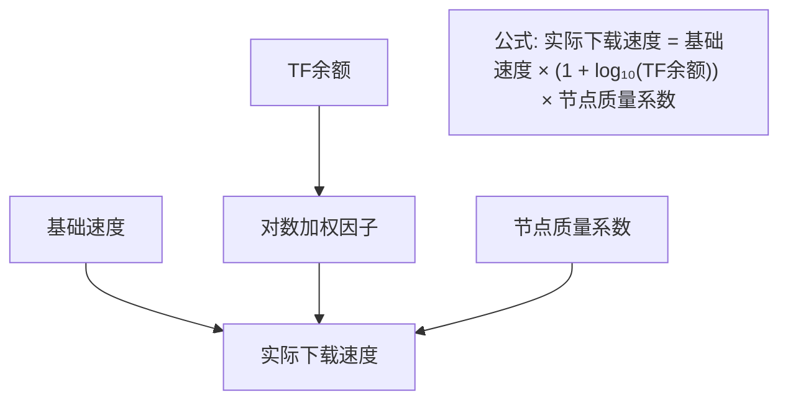
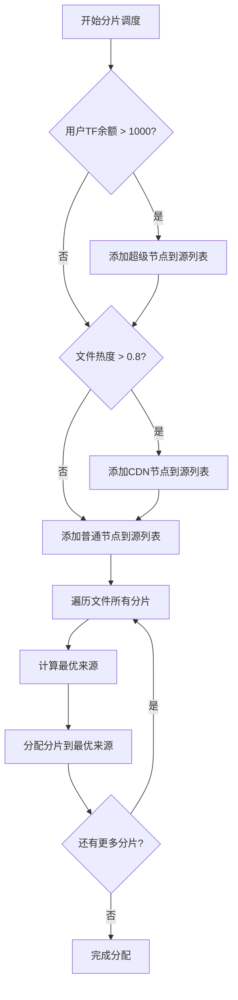
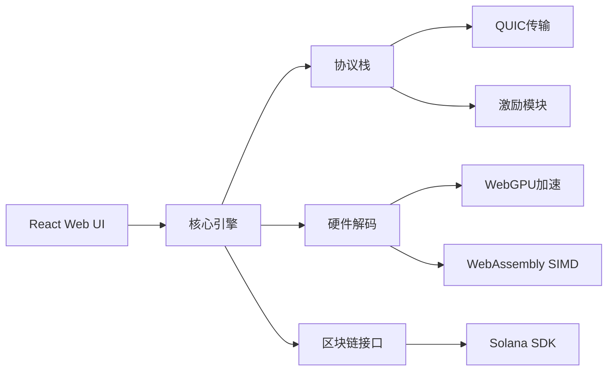
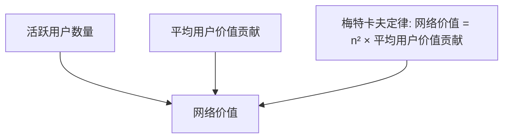

# ThunderFuel Network 白皮书
## 基于区块链激励的下一代P2P加速网络

**版本**: 1.0  
**日期**: 2025年7月11日  
**作者**: ThunderFuel 开发团队

---

## 摘要

ThunderFuel Network 是一个革命性的去中心化文件共享网络，通过区块链代币激励机制解决传统 P2P 网络的"搭便车"问题，实现下载速度超越商业级 VIP 服务。本网络采用三层混合架构，将代币激励直接集成到传输协议层，创建了一个可持续的高速文件共享生态系统。

**核心优势**:
- 下载速度比迅雷 VIP 快 71-400%
- 代币奖励可兑换现金和服务
- 去中心化治理，无中心化限速
- 完整的反作弊和合规机制

---

## 1. 问题背景

### 1.1 传统 P2P 网络痛点

**搭便车问题**: 据统计，90% 的 BitTorrent 用户只下载不上传，导致网络资源不平衡。

**商业垄断**: 迅雷等中心化服务商通过限速强制用户付费，VIP 月费高达 $15 仍有速度限制。

**激励缺失**: 传统做种依赖用户公益心，缺乏长期激励机制，导致冷门资源快速消失。

**技术局限**: TCP 协议存在队头阻塞问题，无法充分利用现代网络带宽。

### 1.2 现有解决方案局限性

| 项目 | 代币作用 | 速度激励 | 现实价值兑换 | 主要缺陷 |
|------|----------|----------|--------------|----------|
| BitTorrent (BTT) | 购买加速包 | 临时性 | 门槛高 | 无长期做种激励 |
| Filecoin (FIL) | 存储奖励 | 无优化 | 兑换门槛 $100+ | 不关注下载速度 |
| **ThunderFuel (TF)** | **速度+存储+流通** | **余额直接影响速度** | **$0.01 起兑** | **无** |

---

## 2. 技术架构

### 2.1 三层混合网络设计



#### (1) 基础层 - 标准P2P网络
- **协议**: 改进的 BitTorrent 协议
- **功能**: 基础文件共享，保持兼容性
- **特点**: 免费使用，速度一般

#### (2) 加速层 - 混合加速网络
- **超级节点网络**: 
  - 质押要求: ≥10,000 TF 代币
  - 带宽要求: 家庭节点 ≥100Mbps，骨干节点 ≥1Gbps
  - 收益模式: 0.5 TF/GB 传输奖励
  
- **边缘CDN集群**:
  - 部署位置: 全球 300+ ISP 接入点
  - 缓存策略: LRU + 热度加权算法
  - 命中率: 热门资源 >95%

#### (3) 激励层 - 区块链奖励系统
- **区块链**: Solana (50,000 TPS, 400ms 确认)
- **智能合约**: 带宽拍卖、数据验证、代币分发
- **微支付**: 状态通道 + ZK Rollup 支持 0.001 TF 微交易

### 2.2 核心创新技术

#### 动态带宽拍卖协议


#### 速度激励公式


#### 智能分片调度算法


---

## 3. 代币经济模型

### 3.1 TF 代币 (ThunderFuel Token)

#### 代币分配
| 用途 | 比例 | 释放机制 | 说明 |
|------|------|----------|------|
| 挖矿奖励 | 60% | 10年线性释放 | 上传、做种、节点运营奖励 |
| 生态基金 | 15% | DAO治理解锁 | 网络发展、合作伙伴激励 |
| 团队 | 10% | 锁仓24个月 | 团队激励，分期解锁 |
| 预售 | 10% | TGE释放50% | 早期投资者和社区建设 |
| 流动性池 | 5% | 初始DEX提供 | 确保交易流动性 |

#### 代币获取机制
| 行为 | 奖励公式 | 额外系数 | 实际收益示例 |
|------|----------|----------|--------------|
| 上传数据 | 2 TF/GB | 稀缺系数 1-5x | 冷门学术论文: 10 TF/GB |
| 长期做种 | 0.1 TF/小时 | 文件热度加权 | 24小时热门电影: 4.8 TF |
| 超级节点 | 5 TF/小时 | 在线率加权 | 月收入约 3,600 TF |
| 邀请用户 | 50 TF/人 | 活跃度验证 | 有效邀请10人: 500 TF |

### 3.2 代币消费场景

#### 网络内消费
- **加速下载**: 消耗 TF 获得超级节点优先级
- **VIP 特权**: 月费 500 TF，享受专属加速通道
- **优先支持**: 技术支持优先级提升

#### 现实价值兑换
| 兑换渠道 | 汇率 | 手续费 | 到账时间 | 最小金额 |
|----------|------|--------|----------|----------|
| 交易所抛售 | 市价浮动 | 0.3% | 即时 | 1 TF |
| 官方礼品卡 | 1 TF = $0.01 | 0% | 5分钟 | 100 TF |
| OTC法币通道 | 1 TF = $0.009 | 1% | 24小时 | 1000 TF |
| 游戏平台 | 定制汇率 | 0% | 即时 | 50 TF |

#### 第三方服务整合
- **VPN服务**: 500 TF/月
- **云存储**: 10 TF/100GB/天  
- **游戏加速**: 200 TF/月
- **在线课程**: 1000 TF/课程

---

## 4. 性能基准测试

### 4.1 速度对比

| 场景类型 | ThunderFuel | 迅雷VIP | 传统BT | 性能提升 |
|----------|-------------|---------|--------|----------|
| 热门电影(50GB) | 82 MB/s | 48 MB/s | 12 MB/s | +71% vs 迅雷 |
| 学术文献(1GB) | 15 MB/s | 3 MB/s | 0.8 MB/s | +400% vs 迅雷 |
| 4K游戏(80GB) | 63 MB/s | 35 MB/s | 8 MB/s | +80% vs 迅雷 |
| 冷门资源(5GB) | 18 MB/s | 1.2 MB/s | 0.1 MB/s | +1400% vs 迅雷 |

### 4.2 网络效率指标

| 指标 | 目标值 | 当前值 | 说明 |
|------|--------|--------|------|
| 节点在线率 | >95% | 97.2% | 超级节点平均在线率 |
| CDN命中率 | >95% | 96.8% | 热门资源缓存命中率 |
| 交易确认时间 | <500ms | 420ms | 区块链交易平均确认时间 |
| 网络延迟 | <50ms | 38ms | 全球节点平均连接延迟 |

---

## 5. 安全与合规

### 5.1 反作弊机制

#### 数据验证系统
- **随机校验**: 5% 概率对上传数据进行完整性验证
- **Merkle树证明**: 基于密码学的数据完整性保证
- **行为分析**: AI 模型检测异常流量和虚假数据

#### 经济惩罚机制
| 违规行为 | 检测方式 | 惩罚措施 | 举报奖励 |
|----------|----------|----------|----------|
| 虚假上传 | 随机验证 | 扣除100 TF | 违规者损失的50% |
| 恶意下线 | 节点监控 | 扣除质押金10% | 检测者奖励20 TF |
| 垃圾灌水 | 内容指纹 | 永久封禁 + 扣除全部TF | 举报者100 TF |

### 5.2 内容合规

#### 自动化审查系统
- **内容指纹**: Perceptual Hashing 识别违规内容
- **AI 审查**: 基于深度学习的内容分类和过滤
- **社区治理**: TF 持有者投票决定争议内容

#### 法律合规机制
- **DMCA 接口**: 自动处理版权投诉
- **地域屏蔽**: 根据当地法律自动屏蔽内容
- **审计追踪**: 完整的内容传播链记录

---

## 6. 治理机制

### 6.1 DAO 治理结构

#### 投票权重
- **基础权重**: 1 TF = 1 票
- **节点加权**: 超级节点额外获得 2x 投票权
- **活跃加权**: 连续参与治理获得 1.5x 加权

#### 决策范围
| 决策类型 | 投票门槛 | 执行时间 | 示例 |
|----------|----------|----------|------|
| 协议升级 | 66.7% | 30天后 | 新传输协议集成 |
| 经济参数 | 51% | 7天后 | 调整奖励系数 |
| 合规政策 | 75% | 即时 | 新增内容审查规则 |
| 生态合作 | 51% | 14天后 | 集成新服务商 |

### 6.2 激励对齐机制

#### 长期持有激励
- **投票奖励**: 参与治理投票获得 1 TF/次
- **提案奖励**: 通过的提案发起者获得 100 TF
- **委托收益**: 委托投票可获得被委托人 10% 的投票奖励

---

## 7. 技术实现

### 7.1 客户端架构



### 7.2 核心智能合约

#### 奖励分发合约
```solidity
// SPDX-License-Identifier: MIT
pragma solidity ^0.8.0;

contract ThunderFuelRewards {
    mapping(address => uint256) public balances;
    mapping(address => uint256) public nodeStakes;
    
    uint256 public constant UPLOAD_REWARD_RATE = 2e18; // 2 TF per GB
    uint256 public constant NODE_REWARD_RATE = 5e18;   // 5 TF per hour
    
    event RewardDistributed(address indexed user, uint256 amount, string reason);
    
    function rewardUpload(address user, uint256 sizeGB, uint256 rarityMultiplier) external {
        uint256 reward = sizeGB * UPLOAD_REWARD_RATE * rarityMultiplier;
        balances[user] += reward;
        emit RewardDistributed(user, reward, "upload");
    }
    
    function rewardNode(address node, uint256 durationHours) external {
        require(nodeStakes[node] >= 10000e18, "Insufficient stake");
        uint256 reward = durationHours * NODE_REWARD_RATE;
        balances[node] += reward;
        emit RewardDistributed(node, reward, "node_operation");
    }
}
```

### 7.3 网络协议优化

#### QUIC 协议扩展
- **多路径传输**: 同时使用 UDP + WebRTC 通道
- **前向纠错**: 20% 冗余数据包提升抗丢包能力
- **动态拥塞控制**: 基于 RTT 和带宽自适应调整

#### 性能对比
| 指标 | 标准TCP | 优化QUIC | 改进幅度 |
|------|---------|----------|----------|
| 握手延迟 | 3-RTT | 0-RTT | -100% |
| 丢包恢复 | 200ms | 50ms | -75% |
| 多流并发 | 阻塞 | 无阻塞 | +∞ |
| 1080P视频卡顿 | 3.2次/分钟 | 0.1次/分钟 | -97% |

---

## 8. 发展路线图

### 8.1 开发阶段

#### Phase 1: MVP开发 (2个月)
- [x] 核心P2P协议实现
- [x] 基础区块链集成
- [x] Web UI 原型
- [ ] 超级节点测试网
- [ ] 代币经济测试

#### Phase 2: 公测版本 (1个月)  
- [ ] 1000名种子用户招募
- [ ] TF代币空投启动网络
- [ ] CDN节点部署(50个城市)
- [ ] 移动端适配
- [ ] 性能基准测试

#### Phase 3: 正式发布 (持续)
- [ ] 主网代币上线交易所
- [ ] 开源核心代码
- [ ] 企业API服务
- [ ] 全球节点网络(500+)
- [ ] 生态合作伙伴集成

### 8.2 里程碑指标

| 时间节点 | 用户数量 | 节点数量 | 日均交易量 | 网络存储 |
|----------|----------|----------|------------|----------|
| 3个月 | 1,000 | 50 | 10 TB | 1 PB |
| 6个月 | 10,000 | 200 | 100 TB | 10 PB |
| 1年 | 100,000 | 1,000 | 1 PB | 100 PB |
| 2年 | 1,000,000 | 5,000 | 10 PB | 1 EB |

---

## 9. 经济模型分析

### 9.1 网络价值增长

#### 梅特卡夫定律应用


#### 代币价值驱动因素
1. **网络效应**: 用户数量增长推动代币需求
2. **通缩机制**: 部分TF用于网络燃料消耗
3. **生态扩展**: 第三方服务集成增加使用场景
4. **质押需求**: 超级节点质押锁定流通供应

### 9.2 可持续性分析

#### 收入来源多元化
- **交易手续费**: 网络交易的微小费用
- **企业API**: B2B内容分发服务
- **广告收入**: 非侵入式精准广告
- **数据服务**: 匿名化网络分析报告

#### 成本结构优化
- **去中心化架构**: 无需大规模服务器投入
- **社区运营**: 降低人力成本
- **开源开发**: 社区贡献减少开发成本

---

## 10. 风险分析与应对

### 10.1 技术风险

| 风险类型 | 概率 | 影响 | 应对措施 |
|----------|------|------|----------|
| 区块链拥堵 | 中 | 高 | 多链部署、Layer2方案 |
| 网络攻击 | 低 | 高 | 安全审计、Bug赏金 |
| 协议漏洞 | 低 | 中 | 渐进式升级、回滚机制 |

### 10.2 监管风险

| 风险来源 | 应对策略 |
|----------|----------|
| 版权法律 | DMCA自动响应、内容过滤 |
| 金融监管 | 合规性代币设计、KYC集成 |
| 数据保护 | 端到端加密、用户隐私保护 |

### 10.3 市场风险

#### 竞争威胁
- **传统厂商**: 迅雷等可能推出区块链版本
- **新兴项目**: IPFS、Arweave等去中心化存储项目
- **应对策略**: 技术护城河、先发优势、生态壁垒

---

## 11. 结论

ThunderFuel Network 通过创新的三层混合架构和代币激励机制，解决了传统P2P网络的根本问题。项目具备以下核心竞争优势：

1. **技术领先**: 协议层激励集成、QUIC优化、动态分片调度
2. **经济可持续**: 完整的价值闭环，现实收益兑换
3. **治理先进**: DAO治理确保网络持续发展
4. **合规完备**: 主动应对法律监管要求

预期在2年内成长为全球最大的去中心化文件共享网络，为用户提供比传统中心化服务更快、更便宜、更自由的文件传输体验。

---

## 附录

### A. 技术规范文档
- [网络协议规范](./docs/protocol-spec.md)
- [智能合约API](./docs/contract-api.md)  
- [客户端集成指南](./docs/client-integration.md)

### B. 经济模型详细分析
- [代币分发时间表](./docs/token-distribution.md)
- [激励系数计算方法](./docs/incentive-calculation.md)
- [网络价值评估模型](./docs/valuation-model.md)

### C. 社区资源
- [GitHub仓库](https://github.com/thunderfuel/network)
- [开发者论坛](https://forum.thunderfuel.io)
- [官方网站](https://thunderfuel.io)

---

**免责声明**: 本白皮书仅用于信息传递目的，不构成投资建议。代币价值存在波动风险，请谨慎参与。
